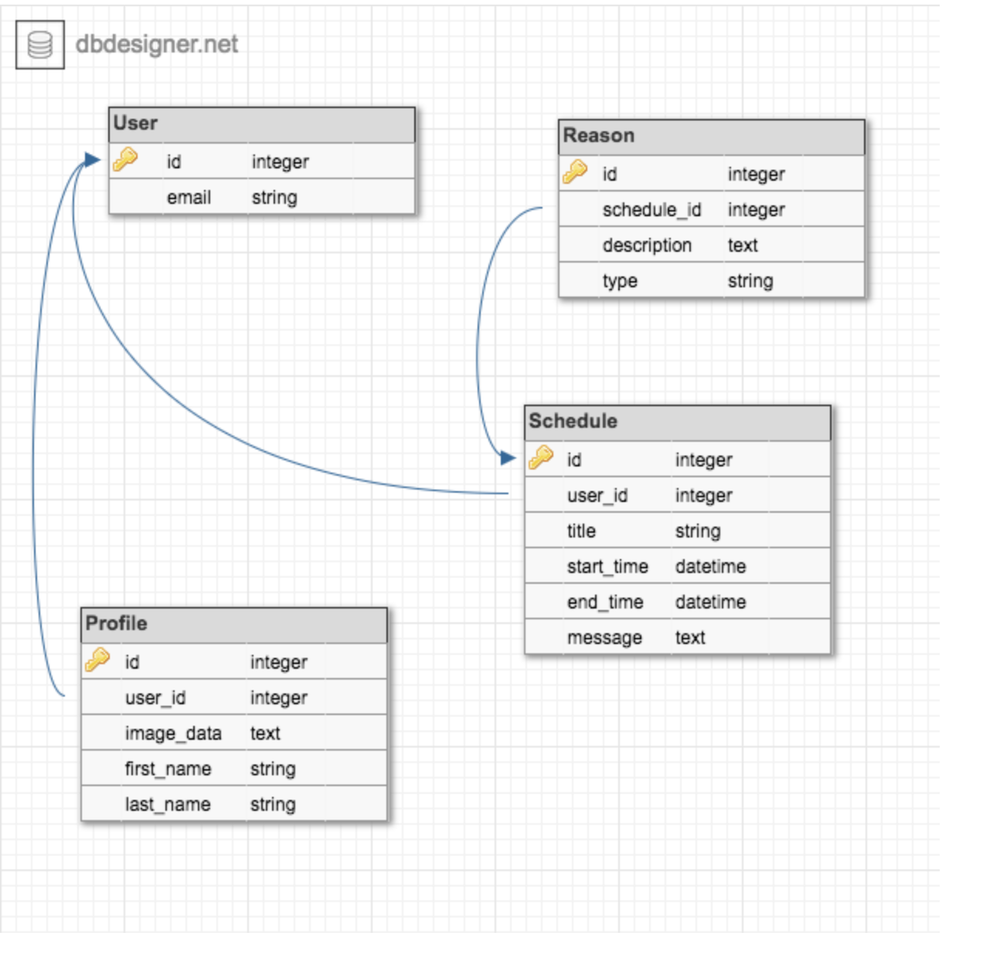
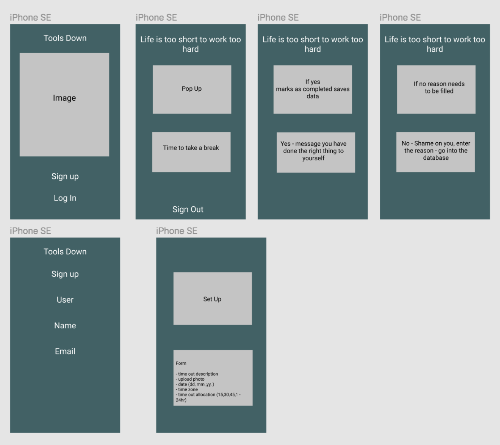
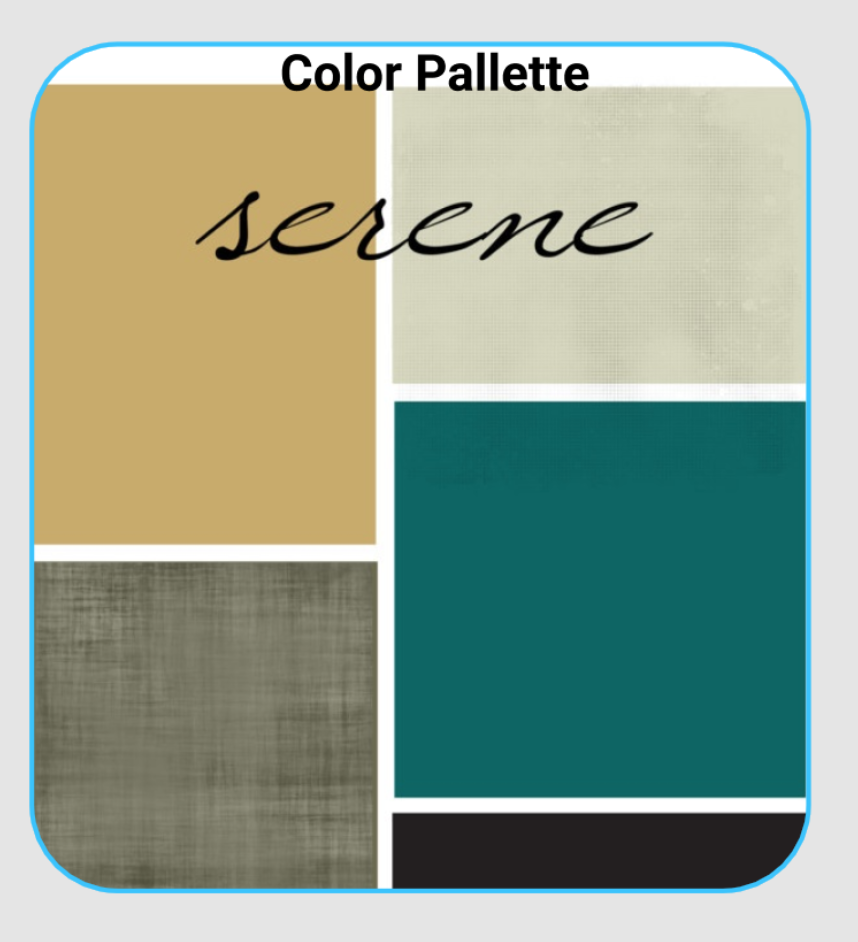

# App Name : Tools Down

The tools down app is the new app designed to remind users to tkae time out of the day away from work so the user will have a work/life balance.

- email:string

user has_one: profile
user has_many: schedule

## Model Profile

- image_data: text
- first_name: string
- last_name: string
- user:references

## Schedule
- title: string
- start_time: datetime
- end_time: datetime
- message: text
- user: references

schedule has_one: reason

## Reason
- description: text
- type: string
- schedule: references

Trello

source : https://trello.com/b/hVHQ6Bai/ca-hackathone1

## Database Diagram

<!--  -->

## Wireframes

source : https://www.figma.com/file/QbBRV41PrEE4PIa4HUuOxDDY/Tools-Down

add shaun Michale and Andrew as collaborators

## to schedule messages
- add delayed_job gem
- create table in db
- create a scaffold for entry of scheduled messages
- use active job to add the schedule the message
  - create an active job for the message
